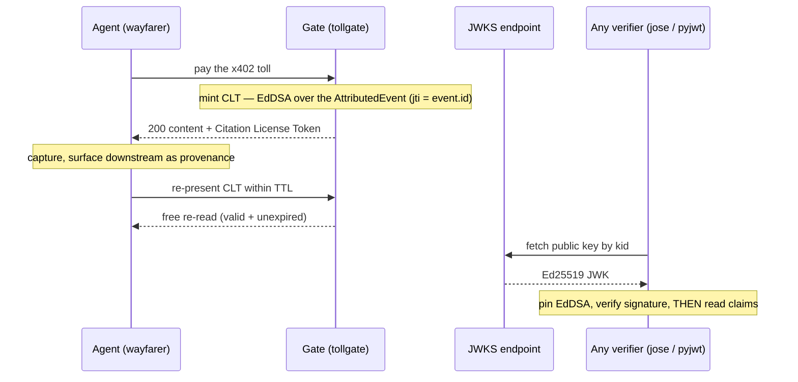

# Citation License Token (CLT) — spec

> The durable specification of the token: its claims, the verifier's rules, the
> security invariants, and how any stack verifies one. Implementation lives in
> `shared/license.ts` (mint/verify), the tollgate (mint-on-pay, free re-read, JWKS,
> online tier), and the wayfarer (capture/present).

## Thesis

When an agent pays the x402 toll, the tollgate returns a **signed, independently
verifiable receipt** — the Citation License Token — proving *who paid, how much
USDC, for which essay, to which author wallet(s) with what split, settled on-chain*.
The agent surfaces it downstream as provenance, and re-presenting a valid unexpired
CLT re-reads that essay **free** within a short window.

This converts the toll from an **evadable tax** (agents dodge it by spoofing a human
`User-Agent`) into a **signed asset the payer wants to keep** — so enforcement stops
depending on the human/agent classifier. The CLT is a signed projection of the
`AttributedEvent` already recorded per payment (`jti = event.id`), reusing
`settlementRef` / `payees` / `payerAddress`.

### Lifecycle



## Two CRITICAL invariants (a build that violates either is a free-read bypass)

1. **Stable signing key off the mock path.** Ephemeral Ed25519 keys break a
   reusable, externally-verified token across serverless instances. A stable
   `LICENSE_SIGNING_KEY` is **required** (fail loud at boot) whenever
   `LICENSES_ENABLED && (PAYMENT_MODE!=='mock' || EVENTS_BACKEND==='supabase' || NONCE_BACKEND==='supabase')`.
   Ephemeral is allowed **only** for single-instance mock/dev.
2. **The verifier ignores the token's `alg` header and hard-pins EdDSA.** The
   public key is world-readable at the JWKS endpoint, so trusting `header.alg`
   enables `alg:none` and HMAC-with-public-key forgery. Pin the algorithm, verify
   over the literal received bytes, and parse claims only **after** the signature
   passes.

## Resolved design decisions

| Question | Decision | Why |
|---|---|---|
| Token binding & TTL | Bind to **slug + kind + iss + aud** (all mandatory-equal); `kind` is equal-or-greater privilege (a citation license entitles a read, never the reverse). `sub`=payer is a **provenance claim only**, not a re-read security boundary in v1. TTL default **600s**, hard cap 3600s. | slug-only = a public free-read coupon; slug+`sub` is illusory over plain HTTP (no proof-of-possession on a GET). The honest model is a short-TTL bearer entitlement; TTL is the only offline kill switch. Matches the nonce's existing amount+payTo+network binding bar. |
| Claim surface | Embed **full `payees[]`** by default (`LICENSE_PAYEES_MODE=full`); `hashed` mode emits `payeesHash` + primary `payTo` only. | The recursive co-author split is the thing the token exists to prove, and wallets are already public on-chain via `settlementRef`. Hashed is a first-class option for publishers who don't want the full graph cached. |
| Key management | **Stable key required** off the mock path (zod superRefine, mirrors the supabase-creds check). Ephemeral only single-instance mock. JWKS always carries a `kid = base64url(SHA-256(rawPublicKey))[:16]`. | Ephemeral keys on Vercel fan-out make JWKS + paid re-read non-deterministic and void licenses on every cold start. `kid` makes rotation/revocation possible. |
| Revocation | **Seam in v1**, enforced on the **online tier + the gate's own re-read path** (a `jti` denylist reusing the ConsumedStore/Supabase pattern) + **kid-based** key revocation. The **offline JWKS tier stays exp-only** by nature (documented limit, bounded by short TTL). | Strongest middle: a remedy for leak/key-compromise exists without forcing shared state onto the offline/mock/no-creds path. |
| JWS hardening | Verifier ignores `alg`, hard-pins EdDSA; rejects `alg:none`, `crit/jku/x5u/jwk`, >4 KB input, wrong segment count / non-base64url; verifies literal received ASCII bytes; reads claims post-verify only. | The published public key makes HMAC-confusion forgery *practical*, not theoretical. |
| Route order & jti | Register `/.well-known/naulon-jwks.json` and `/licenses/:jti` **before** `app.all('*')`; exclude those prefixes in `slugFromPath`. Change `event.id`/`jti` to a **full `randomUUID()`** (drop `.slice(0,8)`); keep `:` out of the composed id. | The catch-all otherwise proxies the routes to origin. The sliced UUID risks a `jti` collision → Supabase `ignore-duplicates` silently drops a *paid* event and `/licenses/:jti` returns the wrong one. |

## Token spec (CLT v1)

A **strict RFC 7519 JWT**, EdDSA-signed (Ed25519), verifiable by an unmodified
`jose` / `pyjwt` / `golang-jwt` client with zero bespoke code.

**Wire:** compact JWS `base64url(header).base64url(payload).base64url(sig)` (no padding, `-`/`_`).

**JOSE header (exact):**
```json
{ "alg": "EdDSA", "typ": "JWT", "kid": "<base64url(SHA-256(rawEd25519PublicKey))[:16]>" }
```
No `crit`/`jku`/`x5u`/`jwk` — verifier MUST reject if present.

**Claims (registered + one namespaced `naulon` object):**
```jsonc
{
  "iss": "naulon:<host>",            // = LICENSE_ISSUER; verifier enforces equality
  "aud": "naulon:<host>",            // the gate's own host; enforced on re-read
  "sub": "<payerAddress>",           // provenance only; NOT a re-read security boundary in v1
  "jti": "<event.id = full randomUUID()>",
  "iat": <epoch seconds>,
  "nbf": <iat>,
  "exp": <iat + LICENSE_TTL_SECONDS>,
  "naulon": {
    "v": 1,
    "slug": "<event.slug>",
    "title": "<article title>",
    "kind": "read" | "citation",
    "amount": "<micro-USDC integer string>",   // integer micro-USDC, never a float
    "currency": "USDC",
    "network": { "chainId": <n>, "usdc": "0x..", "gateway": "<id>" },
    "settlementRef": "<event.settlementRef>",
    "payees": [ { "authorId", "wallet", "share" }, ... ]   // full mode
    // hashed mode: "payeesHash": "<base64url(SHA-256(canonical payees JSON))>", "payTo": "0x..(primary)"
  }
}
```

**Signing** — `crypto.sign(null, msg, ed25519PrivateKey)` over
`b64url(header)+'.'+b64url(payload)` (node:crypto, no new dep). Key never logged;
the `X-Naulon-License` header is treated as a secret (not in `logger()` output).

**`mint(event, host, now)`** — pure, in `shared/license.ts`. Explicit `now` (no
`Date.now()` in shared). Mints from **in-memory event fields only** — never reads
the EventSink — so a `record()` failure after settle still yields a valid receipt.

**`verifyLicense(jws, { now, expectedIssuer, expectedAudience, jwks })`** — pure:
1. Cap input at 4096 bytes before any parse.
2. Split on `.`; require exactly 3 base64url segments.
3. Decode header; require `alg==='EdDSA'`, `typ==='JWT'`, `kid` ∈ JWKS; reject `none`, `crit/jku/x5u/jwk`.
4. `crypto.verify(null, Buffer.from(b64h+'.'+b64p,'ascii'), pubKeyForKid, sig)` — literal bytes, not re-serialized JSON.
5. Only after sig passes: `JSON.parse` payload; read claims from that object.
6. Enforce `iss===expectedIssuer`, `aud===expectedAudience`. Time in **seconds**:
   `nowSec=Math.floor(now/1000)`; expired if `nowSec >= exp` (matches nonce's `<=`
   discipline); reject `nowSec < nbf-60` and `iat > nowSec+60`.

**Re-read entitlement (gate, before pricing):** on `X-Naulon-License: <jws>` —
verify (fail **closed** to the 402 path on any error, never 500, never free
passthrough); require `naulon.slug === slugFromPath(path)` (post-decode),
`aud===naulon:<thisHost>`, and `kind` covers the requested kind; if
`LICENSES_ONLINE_CHECK`, consult the `jti` revocation seam. Valid → serve origin
free with `X-Naulon-Verdict: agent reread (license)`.

**Two verify tiers:** *offline* (fetch JWKS once, verify locally — O(1), trustless,
the primary path for wayfarer/dashboard/third parties) and *online*
(`GET /licenses/:jti` via a new `EventSink.get(id)` — Supabase PK lookup
`?id=eq.<jti>&limit=1`; jsonl short-circuits; **never `readAll()`**; rate-limited;
also where revocation is enforced).

**JWKS:** `GET /.well-known/naulon-jwks.json` → standard JWK Set
(`kty:"OKP", crv:"Ed25519", x, kid, use:"sig", alg:"EdDSA"`), all valid kids.

**Delivery:** on a successful pay the gate sets **both** `PAYMENT-RESPONSE` (stock
x402 clients) **and** `X-Naulon-License: <jws>` on the 200.

## Verifying a license (any stack, ~5 lines)

The CLT is a plain RFC 7519 JWT signed with EdDSA, and the gate publishes a
standard JWK Set — so an **unmodified** JWT library verifies it. No naulon
code required. This is the standards play: the snippet *is* the integration.

**Node — [`jose`](https://github.com/panva/jose):**
```js
import { createRemoteJWKSet, jwtVerify } from "jose";

const JWKS = createRemoteJWKSet(new URL("https://naulon.example.com/.well-known/naulon-jwks.json"));
const { payload } = await jwtVerify(token, JWKS, {
  issuer: "naulon:naulon.example.com",
  audience: "naulon:naulon.example.com",
});
// payload.naulon.{ slug, kind, amount, settlementRef, payees } — the attribution.
```

**Python — [`pyjwt`](https://pyjwt.readthedocs.io)** (`pip install "pyjwt[crypto]"`):
```python
import jwt
from jwt import PyJWKClient

key = PyJWKClient("https://naulon.example.com/.well-known/naulon-jwks.json") \
        .get_signing_key_from_jwt(token).key
claims = jwt.decode(token, key, algorithms=["EdDSA"],
                    issuer="naulon:naulon.example.com",
                    audience="naulon:naulon.example.com")
print(claims["naulon"]["slug"])
```

Both enforce the signature, `exp`, `iss`, and `aud` for you. Pin
`algorithms=["EdDSA"]` (pyjwt) / rely on jose's alg-from-JWKS — never accept a
caller-chosen alg. For an authoritative/revocation check, additionally call
`GET /licenses/:jti`. `shared/src/interop.test.ts` proves a minted token verifies
with these generic primitives in CI.

## Security hardening (threat → mitigation)

| Threat | Mitigation |
|---|---|
| `alg:none` / HMAC-with-published-pubkey forgery | Ignore `alg`, hard-pin EdDSA; `crypto.verify(null,...)`; reject `crit/jku/x5u/jwk`; covered by adversarial tests |
| Ephemeral key on Vercel fan-out → flaky verify, voided licenses | Stable `LICENSE_SIGNING_KEY` required off mock (superRefine, fail loud); `kid` for selection/rotation |
| Privilege escalation (read license → citation; cross-essay) | Bind slug+kind+iss+aud; re-derive requested slug/kind on the gate; kind equal-or-greater, never wildcard |
| Cross-deployment replay | Enforce `aud` (= gate host) and `iss` equality — mandatory |
| Zero-address bearer token | Never mint when payer resolved to `0x000…000`; gate skips mint, still serves content |
| Token leak / replay-as-entitlement, no kill switch | TTL default 600 (cap 3600); `jti` denylist (online + re-read); `kid` rotation; header treated as secret in logs |
| DoS via `/licenses/:jti` full scan | `EventSink.get(id)` PK lookup; rate-limit ahead of verify; 4 KB cap before parse |
| base64url / canonicalization / timing pitfalls | Verify literal bytes; parse claims post-verify; strict base64url; `crypto.verify` (constant-time); nonce.ts split discipline |
| Catch-all route hijack | Register JWKS/`/licenses` before `app.all('*')`; test asserts not-proxied |
| `jti` collision → silent paid-event drop | Full `randomUUID()` jti; keep `:` out of composed id |

## Conformance checklist (each item is a behavior a correct implementation guarantees)

1. `verifyLicense` rejects `alg:'none'`.
2. Rejects an HS256 token signed with the published JWKS public key (alg confusion).
3. Rejects header with `crit`/`jku`/`x5u`/`jwk`.
4. Rejects >4096-byte token **before** any parse/decode.
5. Rejects ≠3 segments / non-base64url chars.
6. Verifies literal `b64url(header).b64url(payload)` bytes; a byte-mutated-but-same-JSON payload is **rejected**.
7. Claims read only from the post-verification parse.
8. Enforces `iss` and `aud`; a different `aud` (cross-gate) is rejected.
9. Boundary: `nowSec===exp` ⇒ expired (`>=`); `nowSec===exp-1` ⇒ valid.
10. Units: `exp/iat` are **seconds**, compared to `Math.floor(now/1000)` (no 1000× bug).
11. `iat>nowSec+60` rejected; `nbf-60<=nowSec<exp` accepted.
12. `mint(event,host,now)` takes explicit `now`, no `Date.now()` in shared; `iat`/`exp` deterministic.
13. `mint` reads only in-memory event fields (mints with a failing sink stub).
14. After a successful settle, `record()` throwing still yields **200 + valid `X-Naulon-License`** (not 402).
15. config: stable-key-required condition with no key ⇒ boot fails naming `LICENSE_SIGNING_KEY`.
16. config: mock mode + zero creds still parses (`make demo` unbroken) with `LICENSES_ENABLED` default.
17. JWKS route returns the JWK Set and is **not** proxied to origin.
18. Re-read: `slug` compared post-`decodeURIComponent`; slug-A token on slug-B (incl. `%2F`/unicode) rejected.
19. Re-read privilege: read-license on a citation request rejected; citation-license entitles both.
20. Re-read: malformed/oversized/expired license falls through to **402** (fail closed), never 500/free.
21. `X-Naulon-License` value absent from `logger()` output.
22. `jti` is a full `randomUUID()`; no slug-derived `:` collides two distinct events; Supabase doesn't drop a 2nd distinct paid event.
23. `EventSink.get(id)` exists; supabase PK-filtered single row; jsonl short-circuits; `/licenses/:jti` never calls `readAll()`.
24. Gate does **not** mint when payer is the zero-address fallback.
25. `kid` matches the public-key hash and is in JWKS; unknown-`kid` token rejected clearly.
26. Offline round-trip: mint → verify against local JWKS returns the claims with no network call.
27. An unmodified `jose` (Node) and `pyjwt` (Python) snippet accepts a real minted token (≥ jose in CI).

## Holder-of-key (opt-in via `LICENSE_POP`)

Off by default (`LICENSE_POP=false`): licenses stay short-TTL **bearer** tokens and the
demo loop is untouched. Turned on, the gate mints a license with an RFC 7800 `cnf`
claim — `cnf: { "naulon:addr": <lowercased payer wallet> }` — and a free re-read of
that license is no longer a bearer right.

**Proof wire:** `X-Naulon-Proof: <ts>.<nonce>.<sig>`, where the holder signed
`popMessage({ aud, jti, slug, ts, nonce })` (EIP-191 `personal_sign`). The gate
reconstructs those exact bytes from the *already signature-verified* license claims
plus the proof's `ts`/`nonce`, recovers the signer (viem), and accepts iff:

1. the recovered address equals the wallet in `cnf` (lowercased compare),
2. `ts` is within ±`LICENSE_POP_WINDOW_SECONDS` of the gate clock (freshness, both directions),
3. `(jti, nonce)` has not been spent — single-use via the **same `ConsumedStore`** the 402
   nonces use (memory, or the shared Supabase table with a `pop:` key namespace).

Fails **closed**: a missing, stale, replayed, or wrong-wallet proof drops the caller to
the normal 402 — never a 500, never free. This is a **one-round** proof (self-asserted
fresh `ts`+`nonce`, spent once), not a two-round server-issued challenge: it already
makes a captured token worthless (you need the wallet key to forge a proof). The
residual gap — an on-path TLS attacker racing a captured *proof* within the window — is
out of scope (and the legitimate holder spends the single-use nonce first). The window
is the tuning knob: shorter = tighter replay window, longer = more clock-skew tolerance.

The mock wayfarer derives a deterministic, non-secret **dev wallet** from a fixed seed
(no key committed) so the proof-of-possession loop is fully demonstrable offline:
`LICENSE_POP=true make demo` shows pass 2 re-reading free with `🔑 proof-of-possession`.

## Residual risks (accepted, documented)

1. **Offline tier is unrevocable by construction** — a JWKS-only verifier can't see the `jti` denylist; a leaked token is valid offline until `exp` (≤600s default). Bounded by short TTL + `kid` rotation.
2. **A v1 (bearer) license is a bearer credential** — anyone who captures it within TTL gets a free re-read of that slug. Closed by enabling holder-of-key (`LICENSE_POP`): a captured token is then useless without the payer wallet key. Off by default, so the bearer caveat still applies to the default deployment (bounded by the short TTL).
3. **Zero-address mint guard is a guard, not a structural impossibility** — a future code path that forgets it could mint a bearer token. Enforced by one guard + test.
4. **Online revocation adds a per-verify round-trip + shared-state dependency** — if Supabase is down, the online tier degrades to offline-only (can't see revocations).
5. **jsonl `get(id)` still scans** (short-circuiting) — fine for single-box dev, O(n) worst case for a missing `jti`; indexed path is Supabase-only.
6. **Clock skew beyond 60s** across instances can prematurely reject a near-`exp` license — mitigated by keeping TTL ≫ skew, not eliminated.
7. **Key rotation is operational/manual in v1** — a mis-sequenced rotation can invalidate outstanding licenses early.

## The demo

Lead with **the agent's self-interested free re-read** (pay once, re-read free,
visible in the wayfarer's reasoning) **+ one <10-line trustless `jose` verify**
against the public JWKS. That pairing shows the value without needing anyone else
to adopt anything first.
