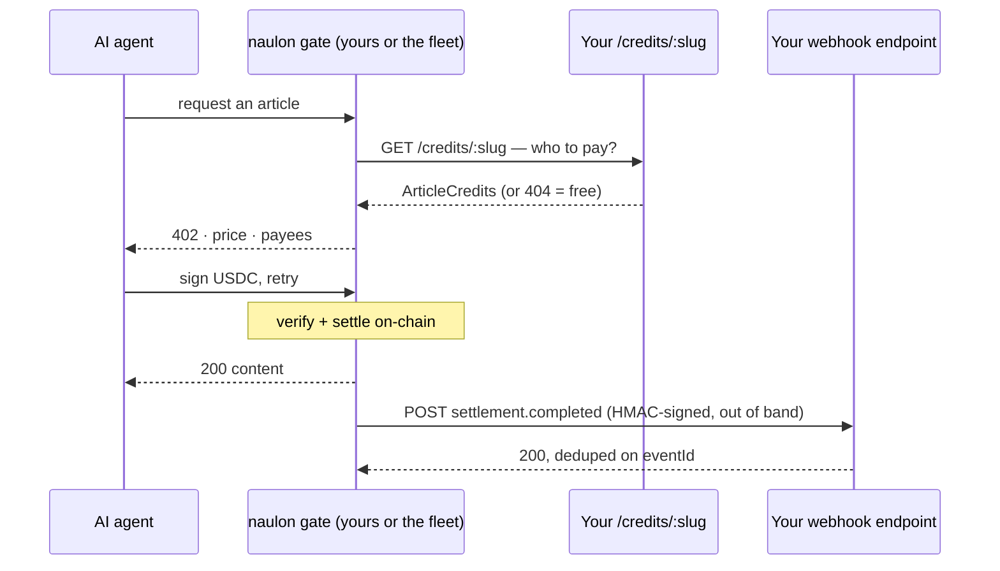

# Integration guide — getting your site tolled

> Start to finish with `@naulon/sdk`: serve the credits endpoint, receive the
> settlement webhook, and self-check before you go live. Two endpoints, both on your
> side — naulon calls you. Works the same whether you run your own gate or sit behind
> the cloud fleet; only where you *declare* your URLs differs.

## What you're building

naulon needs one thing from your site, and gives you one back:

```
1. GET  /credits/:slug        you serve → who to pay for a slug (or 404 = free)
2. POST <your webhook URL>    you serve → naulon reports a settled payment
```

Both are **receive-side**: naulon (your gate, or the fleet) calls *you*. You never
call a naulon URL. The SDK has no naulon base URL in it.


```mermaid
sequenceDiagram
    participant Ag as AI agent
    participant Gate as naulon gate (yours or the fleet)
    participant Cr as Your /credits/:slug
    participant Hook as Your webhook endpoint

    Ag->>Gate: request an article
    Gate->>Cr: GET /credits/:slug — who to pay?
    Cr-->>Gate: ArticleCredits (or 404 = free)
    Gate-->>Ag: 402 · price · payees
    Ag->>Gate: sign USDC, retry
    Note over Gate: verify + settle on-chain
    Gate-->>Ag: 200 content
    Gate->>Hook: POST settlement.completed (HMAC-signed, out of band)
    Hook-->>Gate: 200, deduped on eventId
```

The webhook is deliberately **out of band** — it is sent by a background sweep, not
on the request path, so a slow receiver of yours can never delay a reader.

## Install

```bash
npm install @naulon/sdk
```

The core (`@naulon/sdk`) depends only on `zod` — it's framework-free. The
Next.js adapters live at `@naulon/sdk/next` and treat `next` as an optional
peer; they're plain web-standard `Request → Response` handlers, so they also drop
into any framework that speaks the Fetch API. On **Express**, use
`@naulon/sdk/express` instead — `createExpressCreditsRoute` and
`createExpressWebhookReceiver` are the same logic wrapped for `(req, res)`. They're
a thin bridge over the web-standard handlers, so the contract behaves identically; the
one thing to get right is mounting the receiver with `express.raw({ type: "*/*" })` so
the HMAC sees the exact bytes (see Step 2).

## Step 1 — serve `/credits/:slug`

Map a slug to its author wallet split. Full contract:
[credits-api.md](./credits-api.md).

```ts
// app/api/credits/[slug]/route.ts
import { createCreditsRoute } from "@naulon/sdk/next";
import { httpResolver, fixtureResolver } from "@naulon/sdk";

// Pick a resolver: your CMS endpoint, a static map, or your own CreditsResolver.
import credits from "./credits.json";          // a { slug: ArticleCredits } map
const resolver = process.env.MY_CMS_URL
  ? httpResolver(process.env.MY_CMS_URL)
  : fixtureResolver(credits);

export const GET = createCreditsRoute(resolver, { token: process.env.CREDITS_API_TOKEN });
```

Remember the one rule that trips people up: **return 404 for anything you don't want
tolled.** A 404 is read-for-free, not an error. Drafts, member-only posts, and
wallet-less authors all 404.

## Step 2 — receive the settlement webhook

Record payments as your earnings ledger. Full contract, including the retry semantics
and secret rotation: [settlement-notifications.md](./settlement-notifications.md).

```ts
// app/api/naulon-hook/route.ts
import { createWebhookReceiver } from "@naulon/sdk/next";

export const POST = createWebhookReceiver({
  secrets: [process.env.NAULON_WEBHOOK_SECRET!],  // an array — see rotation in the contract doc
  idempotency: myDurableStore,                    // REQUIRED, durable — see below
  onEvent: async (event) => {
    if (event.type !== "settlement.completed") return;
    await savePayout(event.data);
  },
});
```

On Express it's the same handler, but the route **must** buffer the raw body so the
HMAC sees the exact bytes — `express.json()` parses and discards them, breaking every
signature:

```ts
import express from "express";
import { createExpressWebhookReceiver } from "@naulon/sdk/express";

app.post(
  "/naulon-hook",
  express.raw({ type: "*/*" }),                 // raw bytes, not express.json()
  createExpressWebhookReceiver({ secrets: [process.env.NAULON_WEBHOOK_SECRET!], idempotency: myDurableStore, onEvent: savePayout }),
);
```

**Idempotency is not optional here.** Delivery is at-least-once and an authentic POST
stays replayable for the signature's skew window, so a receiver with no dedupe can
count a payout twice. Back the store's `claim(eventId)` with a database unique
constraint on the event id. The SDK's `memoryIdempotencyStore()` exists for local dev
only and is not durable — do not ship it.

**And if your write fails, fail the response.** Any non-2xx is retried with backoff;
a 200 on a row you never wrote is how a settlement disappears silently.

## Step 3 — self-check before you go live

A money-adjacent receiver should never be tested by POSTing to production, so there's
no dry-run. Instead, sign a fixture offline and run it through your own receiver in
your test suite:

```ts
import { makeSignedWebhookFixture } from "@naulon/sdk";

const { rawBody, headers } = makeSignedWebhookFixture({ secret: process.env.NAULON_WEBHOOK_SECRET! });
// → POST these into your receiver; assert 200 + a written payout.
// → POST them AGAIN; assert deduped, nothing recorded twice.
```

For the credits side, the SDK ships a CLI that does exactly this against your running
endpoint — it validates a real slug against the contract and confirms a nonsense slug
returns `404`:

```bash
npx naulon-kit check https://your-site.example/api --slug a-real-slug
# add --token <t> if your endpoint is bearer-gated;
# add --secret <s> to also print a signed webhook fixture for the test above.
```

It checks the 404 *shape*, not your *policy* — it can't know which slugs you mean to
keep free. A webhook is never POSTed to a live receiver; `--secret` just prints the
offline fixture.

## Declaring your URLs to naulon

The endpoints are the same in both deployment modes; only where you register them
differs. The managed fleet — if you don't want to run a gate yourself — is
[naulon.app](https://naulon.app); "cloud tenant" below means you've onboarded there.

| | You run the gate | You're a cloud tenant |
|---|---|---|
| Who calls your endpoints | your own gate | the fleet |
| Where you set your `/credits` URL | the gate's `CREDITS_API_URL` env | the onboarding flow |
| `/credits` reachability | may be internal/localhost (gate is co-located) | must be public internet — set a bearer `CREDITS_API_TOKEN` |
| Where you register your webhook | the gate's `NAULON_WEBHOOK_ENDPOINTS` env | Settings → API & webhooks |
| Webhook secret | you generate it and put it in that JSON | it's issued once when you create the endpoint |
| The webhook comes from | your gate | the fleet |

Either way the code in Steps 1–2 is identical. If you have no endpoint at all, a
static credits map (a `fixtureResolver`, or the tenant inline-credits option) lets
you toll a small site without hosting anything dynamic.

## Production checklist

- [ ] The webhook `idempotency` is backed by a **durable** unique constraint on
      `eventId` — not the in-memory store.
- [ ] The credits endpoint is served over TLS with its bearer token set; it's a
      money-routing trust boundary (a swapped wallet reroutes a payment).
- [ ] No wallet-less or placeholder addresses leak into a credits response — omit
      the author or 404 the slug until a real wallet exists.
- [ ] You can rotate the webhook secret without downtime (pass `[new, old]` during
      the overlap).
- [ ] Your handler returns a **non-2xx** when it fails to write. A 200 stops the
      retries, so answering it on a failed write drops the notification for good.

## Reference

[`packages/sdk/examples/next-credits/`](https://github.com/naulonapp/naulon/tree/main/packages/sdk/examples/next-credits) is a
runnable App Router app with both endpoints and a fixture — the fastest way to see
the whole shape working before you wire your own data in.
