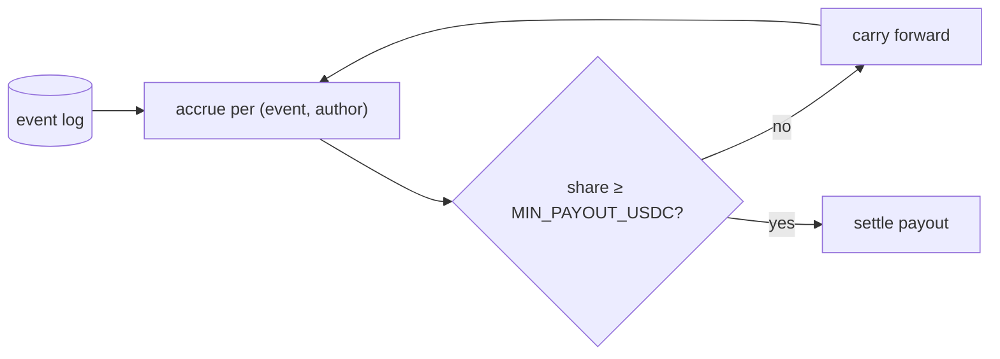

# @naulon/attribution

Turns the gate's event log into author payouts — batching sub-cent tolls per
wallet so settlement stays economical, then paying out.

A single citation can be worth a tenth of a cent; settling each one on its own
would cost more than it pays. So this service accrues every author's share across
many events and only cuts a payout once it clears `MIN_PAYOUT_USDC`, carrying the
remainder forward. Accrual is tracked per `(event, author)`, so a co-author whose
small share is still under the floor keeps accruing while a co-author above it gets
paid — nothing is double-paid, nothing is lost to rounding.

## Run

```bash
npm run -w @naulon/attribution start   # one settlement pass over the ledger
```



Mock settlement runs offline. Real payouts go over Circle's Gateway batching on Arc
with `PAYMENT_MODE=gateway` and a funded wallet. Payments are custody-free — money
moves agent → author; the toll never pools USDC in a wallet the operator controls.

## What's inside

- **`batch.ts`** — group pending shares per wallet, apply the payout floor.
- **`settlement.ts`** — the mock and Circle Gateway settlement drivers.

MIT.
