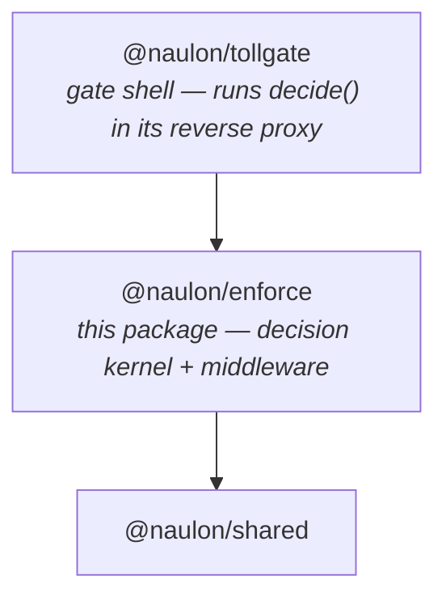

# @naulon/enforce

The runtime-agnostic toll-decision kernel plus the in-app enforcement middleware.

This is the neutral low-level core that both `@naulon/tollgate` (the gate shell —
the reverse-proxy that boots `createApp`) and `@naulon/sdk` (the publisher SDK)
sit **above**, with no dependency cycle. It depends only on `@naulon/shared` (and
`viem`, for the holder-of-key proof). The heavy settlement path — the Circle
facilitator, the pending-leg drain — stays in `@naulon/tollgate`; nothing here
imports `@circle-fin/x402-batching`.

## Why it exists

`decide()` is one pure function: given a web `Request` and a known publisher, it
returns a verdict — serve free, refuse, or `402` with the payment legs — and
performs **no** side effects (no proxy, no settle, no observe). Extracting it lets
two very different runtimes reach the *same* verdict:

- **The gate** (`@naulon/tollgate`) runs `decide()` inside its Hono reverse proxy.
- **In-app middleware** runs the *identical* `decide()` in the publisher's own app,
  so an agent's request reaches the origin directly instead of routing through the
  fleet's single egress IP (which an origin edge can rate-limit).

Both build a byte-identical `402`, because they share this code.

## Exports

### `@naulon/enforce`

The decision kernel and the framework-agnostic middleware core:

- `decide(input)` — the pure verdict function.
- `naulonMiddleware(opts)` — takes a `Request`, returns `{ response, setHeaders }`:
  a `Response` to short-circuit (`402`/`403`), or `null` to let the app render
  (with `setHeaders` to attach to the app's response on a paid pass).
- `withNaulon(handler, opts)` — wrap a generic `fetch` handler.
- `localQuoteSource(fn)` / `httpQuoteSource(url, key)` — pluggable price + payees.
- The classification, Web Bot Auth, nonce, and proof primitives (`classify`,
  `verifyBotAuth`, …) and the x402 build side (`build402`, `buildRequirements`).

### `@naulon/enforce/next`

- `createNaulonMiddleware(opts, NextResponse)` — the Next.js App Router adapter.
  It has no hard `next` dependency; you inject `NextResponse` (your app already has
  it), keeping the core framework-agnostic.

## Usage

```ts
// middleware.ts (Next.js App Router)
import { NextResponse } from "next/server";
import { createNaulonMiddleware } from "@naulon/enforce/next";
import { httpQuoteSource } from "@naulon/enforce";

export const middleware = createNaulonMiddleware(
  {
    publisher: { id: "your-site", articlePrefixes: ["articles"] },
    quote: httpQuoteSource("https://<your-control-plane>/_naulon/quote", process.env.NAULON_API_KEY!),
    verifyUrl: "https://<your-control-plane>/_naulon/verify",
    apiKey: process.env.NAULON_API_KEY!,
  },
  NextResponse,
);

export const config = { matcher: ["/articles/:path*"] };
```

`quote` and `verifyUrl` point at whatever runs the money + catalog legs — the
managed control plane, or your own self-hosted `POST /_naulon/verify` +
`GET /_naulon/quote`. The middleware never holds funds: it forwards the buyer's
signed payment to `verifyUrl`, which settles buyer → author directly.

## Layering

Arrows point to what a package depends on:



A publisher vendors `@naulon/enforce` directly (it builds to its own `dist/`
tarball) and wires the middleware; the gate consumes the very same package, which
is what guarantees both reach an identical verdict. `@naulon/enforce` is
deliberately NOT re-exported through `@naulon/sdk` — the SDK imports `@naulon/shared`,
which re-exports the SDK, so an `sdk → enforce` edge would form a declaration-build
cycle. Keeping enforce standalone (a second, small dependency alongside the SDK)
avoids that and keeps the package graph a clean chain.
