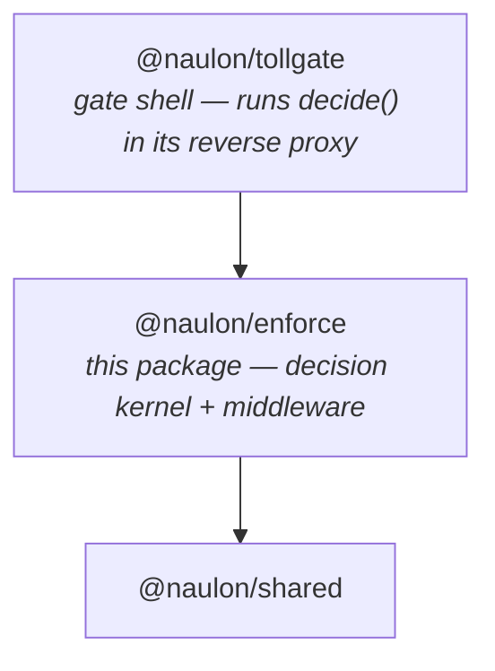

# @naulon/enforce

The runtime-agnostic toll-decision kernel plus the in-app enforcement middleware.

This is the neutral low-level core that both `@naulon/tollgate` (the gate shell, the
reverse-proxy that boots `createApp`) and `@naulon/sdk` (the publisher SDK)
sit **above**, with no dependency cycle. It depends only on `@naulon/shared` (and
`viem`, for the holder-of-key proof). The heavy settlement path, the Circle
facilitator and the pending-leg drain, stays in `@naulon/tollgate`; nothing here
imports `@circle-fin/x402-batching`.

## Why it exists

`decide()` is one pure function: given a web `Request` and a known publisher, it
returns a verdict, whether serve free, refuse, or `402` with the payment legs, and
performs **no** side effects (no proxy, no settle, no observe). Extracting it lets
two very different runtimes reach the *same* verdict:

- **The gate** (`@naulon/tollgate`) runs `decide()` inside its Hono reverse proxy.
- **In-app middleware** runs the *identical* `decide()` in the publisher's own app,
  so an agent's request reaches the origin directly instead of routing through the
  fleet's single egress IP (which an origin edge can rate-limit).

Both build a byte-identical `402`, because they share this code.

## Exports

### `@naulon/enforce`

The decision kernel and the framework-agnostic middleware core:

- `decide(input)`: the pure verdict function.
- `naulonMiddleware(opts)` takes a `Request` and returns `{ response, setHeaders }`:
  a `Response` to short-circuit (`402`/`403`), or `null` to let the app render
  (with `setHeaders` to attach to the app's response on a paid pass).
- `withNaulon(handler, opts)` wraps a generic `fetch` handler.
- `localQuoteSource(fn)` / `httpQuoteSource(url, key)`: pluggable price and payees.
- `httpPublisherConfigSource(url, key)`: what is tolled and for whom, read from the
  control plane and cached per host. It also carries your `/.well-known/x402` manifest
  and your RSL licence, which `serveX402Manifest` and `serveRslDocument` turn into
  routes if the middleware cannot reach those paths.
- The classification, Web Bot Auth, nonce, and proof primitives (`classify`,
  `verifyBotAuth`, …) and the x402 build side (`build402`, `buildRequirements`).
- Cloudflare pay-per-crawl interop: `formatCrawlerPrice`, `parseCrawlerPrice`,
  `declaredCrawlerBudget`, `crawlerBudgetVerdict`, `totalChargedMicro`, and the four
  header constants (`crawler-max-price` / `crawler-exact-price` on the request,
  `crawler-price` on a `402`, `crawler-charged` on a paid `200`). A crawler already
  fluent in that vocabulary can price your origin with no change on its side. You
  advertise in their vocabulary and settle in ours, x402 over USDC, buyer to author, so
  nothing here moves money or changes who is charged. Prices render at full precision
  rather than Cloudflare's `USD XX.XX`: a citation toll is often sub-cent, and
  `(0.001).toFixed(2)` would advertise a free read. It lives here rather than in
  `tollgate` so a self-hosting publisher on the SDK gets it too.

### `@naulon/enforce/next`

- `createNaulonMiddleware(opts, NextResponse)`: the Next.js App Router adapter.
  It has no hard `next` dependency; you inject `NextResponse` (your app already has
  it), keeping the core framework-agnostic.

## Usage

```ts
// proxy.ts (Next.js App Router — `middleware.ts` on Next ≤ 15)
import { NextResponse } from "next/server";
import { createNaulonMiddleware } from "@naulon/enforce/next";
import { httpPublisherConfigSource, httpQuoteSource } from "@naulon/enforce";

const plane = "https://<your-control-plane>";
const key = process.env.NAULON_API_KEY!;

export const proxy = createNaulonMiddleware(
  {
    publisher: { id: "your-site", articlePrefixes: ["articles"] },
    config: httpPublisherConfigSource(`${plane}/_naulon/enforce-config`, key),
    quote: httpQuoteSource(`${plane}/_naulon/quote`, key),
    verifyUrl: `${plane}/_naulon/verify`,
    apiKey: key,
  },
  NextResponse,
);

export const config = { matcher: ["/articles/:path*", "/license.xml", "/.well-known/x402"] };
```

`config` is optional but worth passing. It makes the dashboard the source of what is
tolled, so a scope or crawler-policy change reaches your site without a deploy, and it
is what lets the middleware answer `GET /license.xml` with your RSL licence and
`GET /.well-known/x402` with your payment manifest, before any toll decision. Every 402
links an agent to that manifest, so keep both paths in your matcher when you narrow it.
With `config` omitted, or with `serveLicense: false` / `serveManifest: false`, the
request passes through to your app.

Next 16 renamed the file convention: `middleware.ts` still runs but warns
(`The "middleware" file convention is deprecated. Please use "proxy" instead.`),
and the export it looks for is `proxy`. On Next ≤ 15 keep the file `middleware.ts`
and export `middleware`. The adapter itself is identical either way.

`quote` and `verifyUrl` point at whatever runs the money and catalog legs: the
managed control plane, or your own self-hosted `POST /_naulon/verify` +
`GET /_naulon/quote`. The middleware never holds funds: it forwards the buyer's
signed payment to `verifyUrl`, which settles buyer → author directly.

## Layering

Arrows point to what a package depends on:


```mermaid
flowchart TD
    tollgate["@naulon/tollgate<br/><i>gate shell — runs decide() in its reverse proxy</i>"] --> enforce
    enforce["@naulon/enforce<br/><i>this package — decision kernel + middleware</i>"] --> shared["@naulon/shared"]
```

A publisher vendors `@naulon/enforce` directly (it builds to its own `dist/`
tarball) and wires the middleware; the gate consumes the very same package, which
is what guarantees both reach an identical verdict. `@naulon/enforce` is
deliberately NOT re-exported through `@naulon/sdk`, because `@naulon/shared` imports the SDK
and re-exports it, so an `sdk → enforce` edge would close the loop
`sdk → enforce → shared → sdk`, a declaration-build cycle. Keeping enforce standalone
(a second, small dependency alongside the SDK) avoids that and keeps the package
graph a clean chain.
