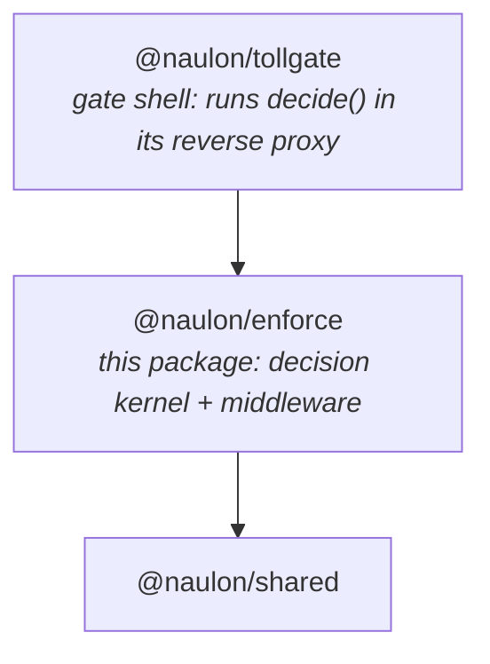

# @naulon/enforce

The runtime-agnostic toll-decision kernel plus the in-app enforcement middleware.

This is the neutral low-level core that both `@naulon/tollgate` (the gate shell, the
reverse-proxy that boots `createApp`) and `@naulon/sdk` (the publisher SDK)
sit **above**, with no dependency cycle. It depends only on `@naulon/shared` (and
`viem`, for the holder-of-key proof). The heavy settlement path, the Circle
facilitator and the pending-leg drain, stays in `@naulon/tollgate`; nothing here
imports `@circle-fin/x402-batching`.

## Why it exists

`decide()` is one pure function: given a web `Request` and a known publisher, it
returns a verdict, whether serve free, refuse, or `402` with the payment legs, and
performs **no** side effects (no proxy, no settle, no observe). Extracting it lets
two very different runtimes reach the *same* verdict:

- **The gate** (`@naulon/tollgate`) runs `decide()` inside its Hono reverse proxy.
- **In-app middleware** runs the *identical* `decide()` in the publisher's own app,
  so an agent's request reaches the origin directly instead of routing through the
  fleet's single egress IP (which an origin edge can rate-limit).

Both build a byte-identical `402`, because they share this code.

## Exports

### `@naulon/enforce`

The decision kernel and the framework-agnostic middleware core:

- `decide(input)`: the pure verdict function. It also honors `PublisherConfig.termsPolicy`
  (`@naulon/shared`): a publisher who declares `ai-input: "free"` gets every agent read served
  free, and `"prohibit"` refuses a recognized AI crawler outright, both ahead of pricing. The
  `/.well-known/x402` manifest reflects the same declaration through `agentReads`. Absent
  `termsPolicy` behaves exactly as before; the single-tenant `envPublisherResolver` never sets
  it; a `PublisherResolver` you write is how you would.
- `naulonMiddleware(opts)` takes a `Request` and returns `{ response, setHeaders }`:
  a `Response` to short-circuit (`402`/`403`), or `null` to let the app render
  (with `setHeaders` to attach to the app's response on a paid pass).
  When the publisher's configuration names a licence server
  (`PublisherConfig.licenceServer`), a crawler presenting `Authorization: License` is checked
  there: the middleware forwards the licence and the crawler's Web Bot Auth signature to the
  server's `/introspect` and passes only when it answers `permitted`. Anything else is the
  ordinary 402, with the reason in the body's `licence_error`, except a charge already in
  flight or unconfirmed, which is a 503 with no x402 offer. The server must share an origin
  with `verifyUrl`, because the check carries your API key.
- `withNaulon(handler, opts)` wraps a generic `fetch` handler.
- `localQuoteSource(fn)` / `httpQuoteSource(url, key)`: pluggable price and payees.
- `httpPublisherConfigSource(url, key)`: what is tolled and for whom, read from the
  control plane and cached per host. It also carries your `/.well-known/x402` manifest
  and your RSL licence, which `serveX402Manifest` and `serveRslDocument` turn into
  routes if the middleware cannot reach those paths.
- The classification, Web Bot Auth, nonce, and proof primitives (`classify`,
  `verifyBotAuth`, …) and the x402 build side (`build402`, `buildRequirements`).
- Cloudflare pay-per-crawl interop: `formatCrawlerPrice`, `parseCrawlerPrice`,
  `declaredCrawlerBudget`, `crawlerBudgetVerdict`, `totalChargedMicro`, and the four
  header constants (`crawler-max-price` / `crawler-exact-price` on the request,
  `crawler-price` on a `402`, `crawler-charged` on a paid `200`). A crawler already
  fluent in that vocabulary can price your origin with no change on its side. You
  advertise in their vocabulary and settle in ours, x402 over USDC, buyer to author, so
  nothing here moves money or changes who is charged. Prices render at full precision
  rather than Cloudflare's `USD XX.XX`: a citation toll is often sub-cent, and
  `(0.001).toFixed(2)` would advertise a free read. It lives here rather than in
  `tollgate` so a self-hosting publisher on the SDK gets it too.

### `@naulon/enforce/next`

- `createNaulonMiddleware(opts, NextResponse)`: the Next.js App Router adapter.
  It has no hard `next` dependency; you inject `NextResponse` (your app already has
  it), keeping the core framework-agnostic.

## Usage

```ts
// proxy.ts (Next.js App Router; `middleware.ts` on Next ≤ 15)
import { NextResponse } from "next/server";
import { createNaulonMiddleware } from "@naulon/enforce/next";
import { httpPublisherConfigSource, httpQuoteSource } from "@naulon/enforce";

const plane = "https://<your-control-plane>";
const key = process.env.NAULON_API_KEY!;

export const proxy = createNaulonMiddleware(
  {
    publisher: { id: "your-site", articlePrefixes: ["articles"] },
    config: httpPublisherConfigSource(`${plane}/_naulon/enforce-config`, key),
    quote: httpQuoteSource(`${plane}/_naulon/quote`, key),
    verifyUrl: `${plane}/_naulon/verify`,
    apiKey: key,
  },
  NextResponse,
);

export const config = { matcher: ["/articles/:path*", "/license.xml", "/.well-known/x402"] };
```

`config` is optional but worth passing. It makes the dashboard the source of what is
tolled, so a scope or crawler-policy change reaches your site without a deploy, and it
is what lets the middleware answer `GET /license.xml` with your RSL licence and
`GET /.well-known/x402` with your payment manifest, before any toll decision. Every 402
links an agent to that manifest, so keep both paths in your matcher when you narrow it.
With `config` omitted, or with `serveLicense: false` / `serveManifest: false`, the
request passes through to your app.

Next 16 renamed the file convention: `middleware.ts` still runs but warns
(`The "middleware" file convention is deprecated. Please use "proxy" instead.`),
and the export it looks for is `proxy`. On Next ≤ 15 keep the file `middleware.ts`
and export `middleware`. The adapter itself is identical either way.

`quote` and `verifyUrl` point at whatever runs the money and catalog legs: the
managed control plane, or your own self-hosted `POST /_naulon/verify` +
`GET /_naulon/quote`. The middleware never holds funds: it forwards the buyer's
signed payment to `verifyUrl`, which settles buyer → author directly.

## Observe mode

Set `tollMode: "observe"` on the publisher to see which agents read what before you charge
anyone. Every decision runs as usual: the request is classified, the crawler's identity is checked
and the read is priced. The read is then served instead of answered with a 402, and reported as a
`denied` observation with `observeOnly: true` and the price it would have paid.

- No payment is taken. A request that presents one is served without settling and reported with
  `paymentPresented: true`. A presented licence is not redeemed either.
- Explicit blocks and prohibited uses are still refused with a 403. Observe stops charging, never a
  refusal you configured.
- When a crawler states a ceiling with `crawler-max-price` or `crawler-exact-price`, the
  observation records `crawlerBudget: "within"` or `"over"`. That is the closest thing to "this
  agent would have paid" a site can measure without asking it to. Charge mode records it too.
- A read with nobody to pay yet is still priced while observing, so you can observe before you set up
  a wallet. Charging in that state serves the read free, as it always has.
- Unset means `charge`, so upgrading changes nothing until you opt in.

Reports go out one request each by default. On a runtime that can keep working after the response
is sent, batch them with `batchingObservationSink` and hand it the runtime's `waitUntil`:

```ts
import { after } from "next/server";
import { batchingObservationSink } from "@naulon/enforce";

const observe = batchingObservationSink(`${plane}/_naulon/observe`, key, { waitUntil: after });
```

Without `waitUntil` it sends each report immediately, like `httpObservationSink`.

## Crawler identity

A user-agent is free text. A scraper that sends `Googlebot/2.1` on a site that lets Googlebot read
free would otherwise read free too. The middleware checks a request that names a known crawler
against that operator's published IP ranges, which it reads from your gate at
`/.well-known/naulon/crawler-ranges.json` (cached for an hour, fetched only when a crawler asks).

Nothing changes on day one. Every claim is checked and reported (`identityCheck` on each
observation), and a forged claim only loses its free read once your control plane has seen that
operator's real crawler at verified addresses: 20 times within 14 days. That is the proof your
site reads the caller's address correctly. A misconfigured setup sees every real crawler as
forged, so it never reaches that point, and no publisher gets deindexed by a header mix-up.

The address comes from your platform's edge header, detected from its environment:

| Platform | Header read | Set `clientIp` |
|---|---|---|
| Vercel | `x-vercel-forwarded-for`, then `x-real-ip` | nothing |
| Netlify functions | `x-nf-client-connection-ip` | nothing (Netlify Edge has no header, so claims there stay unverified) |
| Cloudflare Workers | `cf-connecting-ipv6`, then `cf-connecting-ip` | nothing |
| Cloudflare in front of another platform | `cf-connecting-ipv6`, then `cf-connecting-ip` | `"cloudflare"` |
| Any other edge | the header you name | `{ header: "x-client-ip" }` |

```ts
naulonMiddleware({
  config,
  quote,
  verifyUrl: `${plane}/_naulon/verify`,
  apiKey: process.env.NAULON_API_KEY!,
  clientIp: "cloudflare",
});
```

`clientIp: "none"` or `crawlerRanges: false` turns the check's inputs off, so every claim reads
`unverified` and nothing changes. `crawlerPolicy.forged: "block"` answers a forged claim with the
403 a blocked crawler gets instead of the 402. `identityMode: "off"` skips the check entirely.

## Layering

Arrows point to what a package depends on:


```mermaid
flowchart TD
    tollgate["@naulon/tollgate<br/><i>gate shell: runs decide() in its reverse proxy</i>"] --> enforce
    enforce["@naulon/enforce<br/><i>this package: decision kernel + middleware</i>"] --> shared["@naulon/shared"]
```

A publisher vendors `@naulon/enforce` directly (it builds to its own `dist/`
tarball) and wires the middleware; the gate consumes the very same package, which
is what guarantees both reach an identical verdict. `@naulon/enforce` is
deliberately NOT re-exported through `@naulon/sdk`, because `@naulon/shared` imports the SDK
and re-exports it, so an `sdk → enforce` edge would close the loop
`sdk → enforce → shared → sdk`, a declaration-build cycle. Keeping enforce standalone
(a second, small dependency alongside the SDK) avoids that and keeps the package
graph a clean chain.
