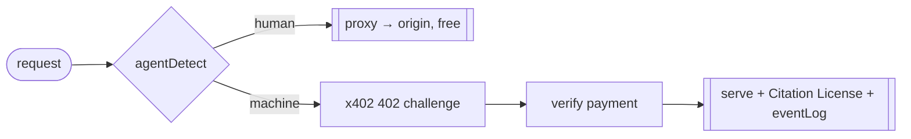

# @naulon/tollgate

The gate itself — an x402 reverse proxy that sits in front of your site, lets
humans through free, and bills machines to read or cite.

Every request is classified (`agentDetect`): a human is proxied straight to your
origin, a machine gets an HTTP `402 Payment Required` carrying the price, the
author wallet(s) to pay, and a signed, single-use nonce. The agent signs a USDC
payment, echoes the nonce, and retries; the gate verifies it — in mock mode
against the HMAC nonce, live against Circle's Gateway on Arc — serves the content,
mints a [Citation License](../../docs/citation-license.md), and records who earned
what in the event log.

It boots through `createApp`, so the multi-tenant cloud control plane injects its
own `TenantResolver` without forking any of this.

## Run

```bash
npm run -w @naulon/tollgate dev      # → http://localhost:8402
```



## What's inside

- **`app.ts`** — the proxy + `createApp` entry point.
- **`agentDetect.ts`** — the human/machine classifier, tuned to favor humans.
- **`x402.ts` / `nonce.ts`** — the `402` challenge and replay-proof nonces.
- **`pricing.ts` / `credits.ts`** — read/citation price and the credits lookup.
- **`arcRelay.ts` / `memoSettle` / `pendingLegs`** — the live Circle settlement path.
- **`eventLog.ts` / `observationLog.ts`** — the attributed-event and traffic sinks.

The full request contract, hardening knobs, and `.well-known/x402` manifest are
documented in the [root README](../../README.md).

MIT.
